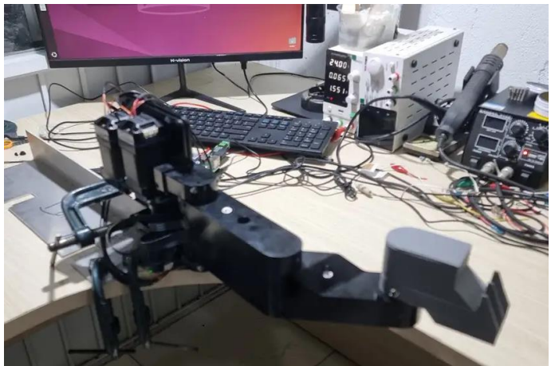
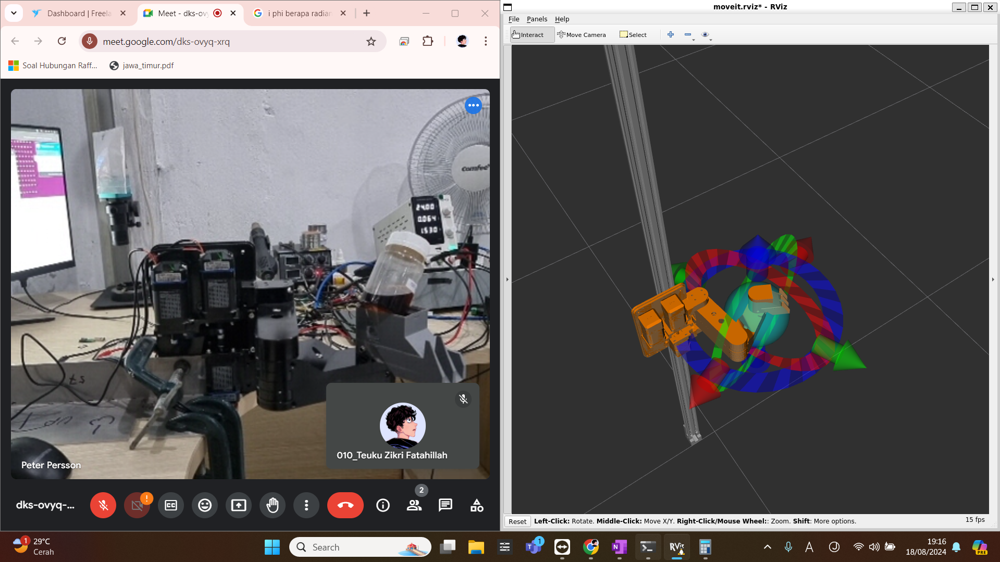
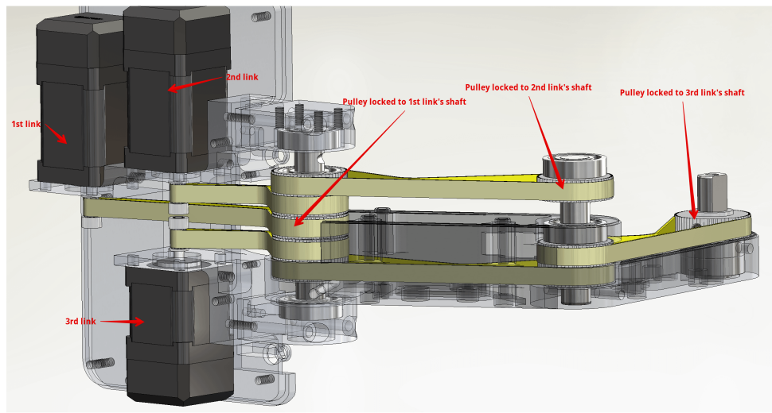
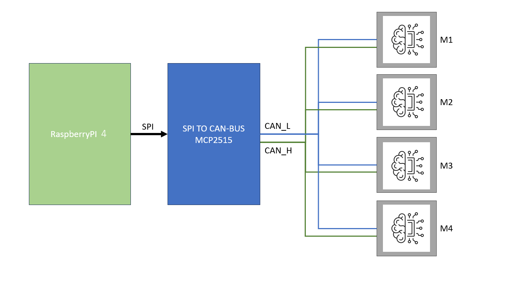
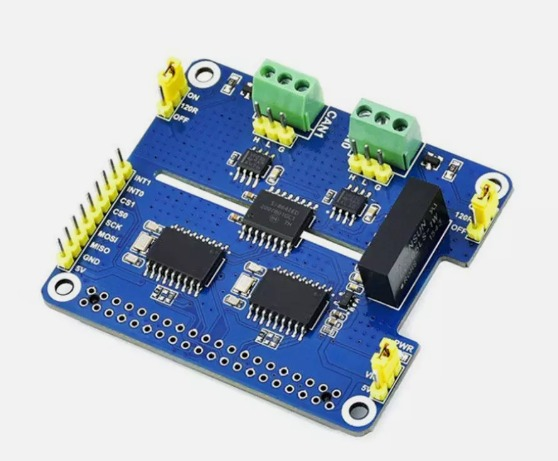

# scara_arm

A 4-DoF SCARA robot arm on a vertical rail, equipped with Integrated Closed-Loop (ICL) stepper motors and a industrial servo motor, all controlled via CAN bus communication.



The software was running on ROS1-Noetic, utilizing a URDF model and MoveIt, with an option to use a custom Tkinter GUI. but for now, we stop using ROS1 and tring to use another messaging library to get realtime system such as ZMQ.



Movelt actually difficult to manage our arm robot, because our robot mechanically different from general arm robot system. each link is connected individually to its motor which is located on the main base instead of the normal, on its parent link. Each link will point to the same global direction regardless of the other link's movement.



That's why We are also developing our own motion designer software called [Dancemotion Designer](https://github.com/tzf230201/Dancemotion-Designer), which is also an ongoing project.

We plan to make the real arm move exact as to the simulation with the same organic smoothness (because our arm is very 
sturdy and backlash free)


Each actuator features a built-in smart MCU, allowing users to configure parameters such as starting speed, acceleration and deceleration times, maximum speed, and total pulse count. These settings enable smooth S-curve acceleration and deceleration.



Commands are sent through the CAN bus using the CANopen protocol. 



[2-CH CAN HAT Module Datasheet](https://www.waveshare.com/wiki/2-CH_CAN_HAT)


**Used RasPi-4 Pins:**

| Fungsi                   | GPIO (BCM) | Physical Pin (40-pin header) |
|--------------------------|------------|------------------------------|
| **SPI MOSI**             | GPIO 10    | Pin 19                       |
| **SPI MISO**             | GPIO 9     | Pin 21                       |
| **SPI CLK (SCK)**        | GPIO 11    | Pin 23                       |
| **CAN0 CS (CE0)**        | GPIO 8     | Pin 24                       |
| **CAN1 CS (CE1)**        | GPIO 7     | Pin 26                       |
| **CAN0 Interrupt**       | GPIO 23    | Pin 16                       |
| **CAN1 Interrupt**       | GPIO 25    | Pin 22                       |
| **Relay**                | GPIO 2    | Pin 3


**There are several type of motion**:
- Linear motion<br>
- P to P fastest motion<br>
- Circular motion<br>
- Horizontal curved Motion<br>
- Vertical curved motion<br>
- Interpolated motion<br>

**Profile types:**<br>
- triangle profile<br>
- trapezoidal profile<br>
- sine profile<br>
- s-shape profile<br><br>


# Installation

## Boot/Firmware/config.txt

```bash
# Enable audio, I2C, and SPI
dtparam=audio=on
dtparam=i2c_arm=on
dtparam=spi=on

# Enable MCP2515 CAN interface
dtoverlay=mcp2515-can1,oscillator=16000000,interrupt=25
dtoverlay=mcp2515-can0,oscillator=16000000,interrupt=23
dtoverlay=spi-bcm2835-overlay
```

after that
```
sudo reboot
```

## Run this before run the main program

```bash
sudo ip link set can0 down
sudo ip link set can0 txqueuelen 1000  # if less then no permission error comes
sudo ip link set can0 type can bitrate 1000000 loopback off
sudo ip link set can0 up
```
**or run can_begin.sh instead, you can put this in .bashrc, it will automatically check and run if it wasn't running yet**

```bash
# === Auto-run CAN setup only once per boot ===
CAN_MARKER="/tmp/can_initialized"

if [ ! -f "$CAN_MARKER" ]; then
    echo "[INFO] Initializing CAN0..."
    bash ~/scara_arm/can_begin.sh && touch "$CAN_MARKER"
fi

```


**Dependencies**
```bash
sudo apt install python3_zmq
sudo apt install python3-can
sudo apt install python3-tk
sudo apt install python3-numpy
sudo apt install python3-matplotlib
sudo apt install python3-pandas
sudo apt install can-utils
```

**Note**
- candump.py used to record all can communication into text file for debugging
- about datasheet,there are 2 datahseet for servo, When i purcasea the servo, the seller give me the newer datasheet (DCH_CANopen.pdf), however is not completed yet, there are several commands that not explained there yet (in my case, i want to know current index of PVT buffer in servo, but it's didn't explained there), so they give me the older one, (CANopen&EtherCAT.pdf), that's why we have 2 datahseet now.


**File System**
```
src/
├── gui.py                  # User Interface (Tkinter)
├── main.py                 # Main entry point
├── callbacks.py            # Event and callback handlers
└── robot.py                # Integration vertical and horizontal axis
    ├── arm.py              # 3 dof scara arm for horizontal axis
    │   └── stepper.py      # Stepper SDK
    │       ├── origin.py   # handle origin information 
    │       └── canbase.py  # SimpleCAn3 & CANOpen protocol
    │    
    ├── servo.py            # Servo SDK for vertical axis
    │   ├── origin.py       # handle origin information
    │   └── canbase.py      # SimpleCAn3 & CANOpen protocol
    └── utility.py          # several tools for debugging
```

** how to design motion**
```
cd csv_files
python3 motion_designer.py
```

Even though it's still an ongoing project,  let [**See it in action**](https://drive.google.com/file/d/1y8DbG6vgjGmnc4_ooR9SQvQAt7R12CfX/view?usp=sharing)


Ask me anything : teukuzikrifatahillah@gmail.com