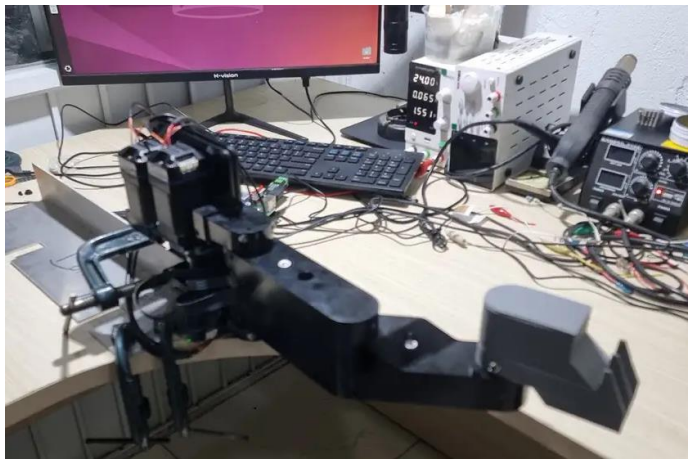
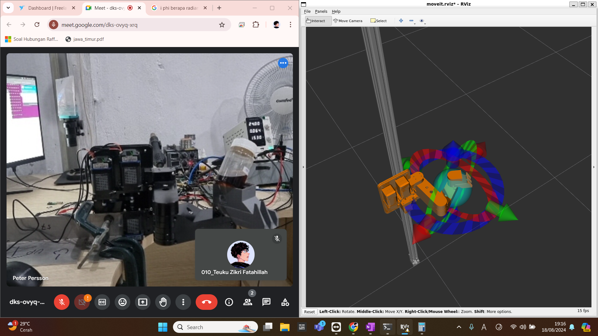
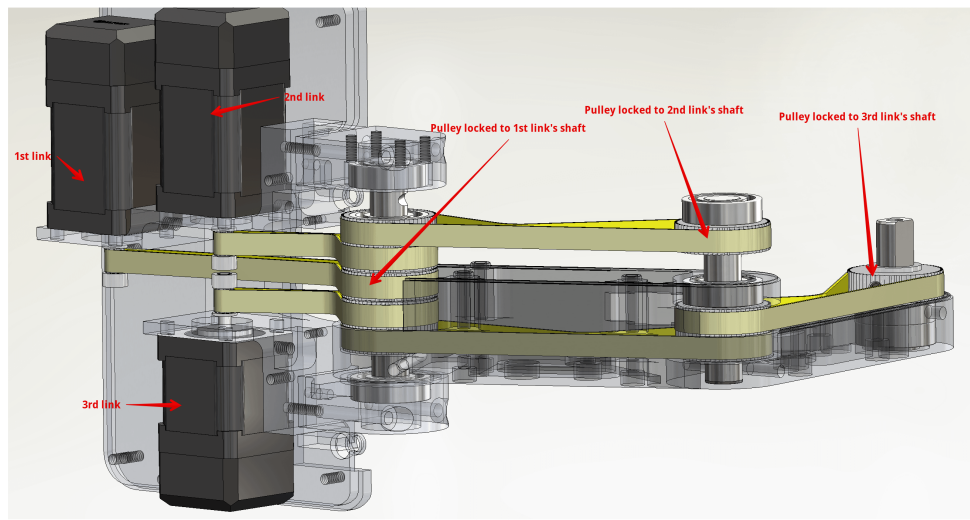
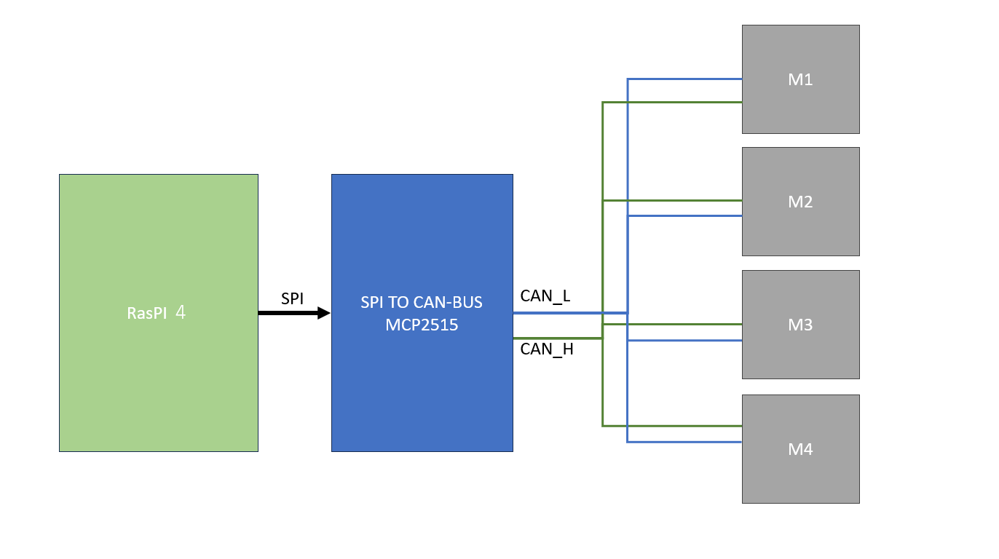
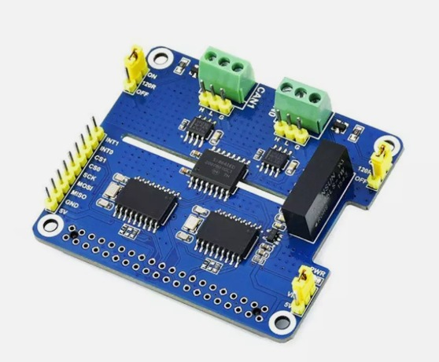

# scara_arm

A 4-DoF SCARA robot arm on a vertical rail, equipped with Integrated Closed-Loop (ICL) stepper motors and a 400-watt industrial servo motor, all controlled via CAN bus communication.

The software currently runs on ROS1-Noetic, utilizing a URDF model and MoveIt, with an option to use a custom Tkinter GUI. 

Movelt actually difficult to manage our arm robot, because our robot mechanically different from general arm robot system. each link is connected individually to its motor which is located on the main base instead of the normal, on its parent link. Each link will point to the same global direction regardless of the other link's movement.

That's why We are also developing our own motion designer software called [Dancemotion Designer](https://github.com/tzf230201/Dancemotion-Designer), which is also an ongoing project.

We plan to make the real arm move exact as to the simulation with the same organic smoothness (because our arm is very 
sturdy and backlash free)

Each actuator features a built-in smart MCU, allowing users to configure parameters such as starting speed, acceleration and deceleration times, maximum speed, and total pulse count. These settings enable smooth S-curve acceleration and deceleration.

Commands are sent through the CAN bus using the CANopen protocol. 

[**2-CH CAN HAT Module Datasheet**](https://www.waveshare.com/wiki/2-CH_CAN_HAT)

**There are several type of motion**:
- Linear motion 
- P to P fastest motion 
- Circular motion 
- Horizontal curved Motion 
- Vertical curved motion 
- Interpolated motion 

**Profile types:** 
- triangle profile 
- trapezoidal profile 
- sine profile 
- s-shape profile  

Even though it's still an ongoing project,  let [**See it in action**](https://drive.google.com/file/d/1y8DbG6vgjGmnc4_ooR9SQvQAt7R12CfX/view?usp=sharing)